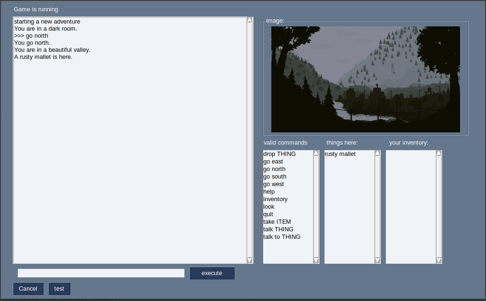

# Adventure-Game
Python3 PySimpleGUI Adventurelib

## installation:
  * install python3 on your computer
  * download the zip of this archive ( green button upper right of this screen) and unpack into an empty folder
  * start game.py with your favorite python editor and run it or simply tpye: 'python3 game.py' or 'python game.py'

## Screenshot

